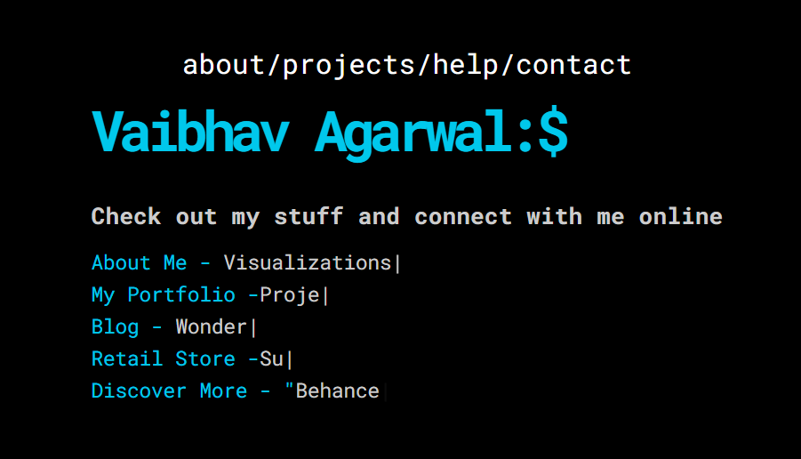

# My Personal Website

This website, created using simple HTML and CSS code and the Winbox JavaScript bundle, is my personal cyber lair. As a collection of my work, passions, interests, and ideas, it reflects my diverse range of interests and aspirations. I have taken inspiration from the Windows PowerShell terminal and the design has been inspired by Tiffany White.

I would also like to extend my gratitude to Matt Boldt for the Typed.js text animation script that adds a layer of dynamism and interactivity to this website.

The World Wide Web, or www, is a vast and complex network of billions of links. My website is a tiny corner of this vast network, yet it represents my own world, a space for me to express myself and share my interests and ideas with the world.

This website is home to three websites of mine:

My Portfolio Website: This website showcases my research work, visualization projects, and collaborations in the fields of economics, statistics, and deep learning.

My Blog: My blog focuses on creating color-blind and visually impaired-friendly visualizations using economic datasets. It presents interesting conclusions and provides a forum for discussions on these topics.

V%bs Retail: My personal store promotes sustainable practices such as reverse shopping and proper waste disposal. Through this store, I hope to contribute to a cleaner and greener planet.

# Navigation 
You can navigate through the website using the links in the navigation bar. The website has the following sections:

About: This section contains information about me.

Projects: This section contains links to my portfolio and research

Help: This section contains information about the website.

Contact: This section contains my contact information.

